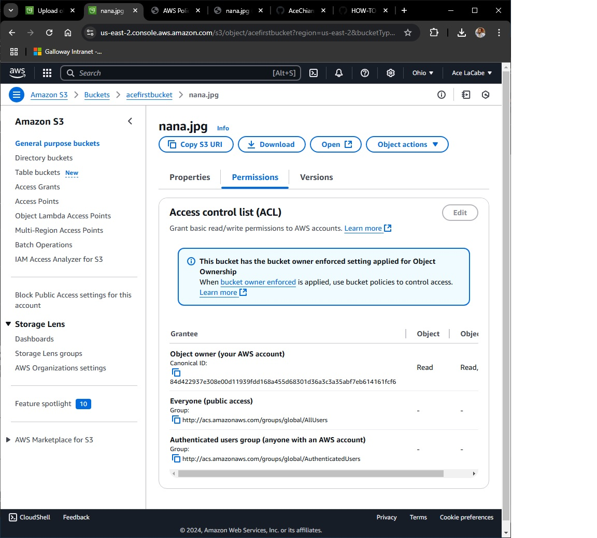

# How to Use Amazon S3 for Public Image Hosting

## Steps to Configure S3
1. **Create a Bucket**: Set up a unique bucket in a preferred region.
2. **Enable Public Access**: Edit bucket permissions to allow public access.
3. **Add a Policy**: Use a bucket policy to define access rules.
4. **Upload an Image**: Add files to the bucket for hosting.
5. **Test the URL**: Verify public access via the image's Object URL.

## Concepts Learned
- **Bucket**: A container for storing objects in Amazon S3.
- **Policy**: Permissions that control access to AWS resources.
- **ARN**: A unique identifier for AWS resources, e.g., `arn:aws:s3:::bucket-name`.
- **Wildcard (`*`)**: Allows flexible matching for resource paths or actions.

## Screenshot

## Public URL
[Image URL](https://acefirstbucket.s3.us-east-2.amazonaws.com/nana.jpg)
